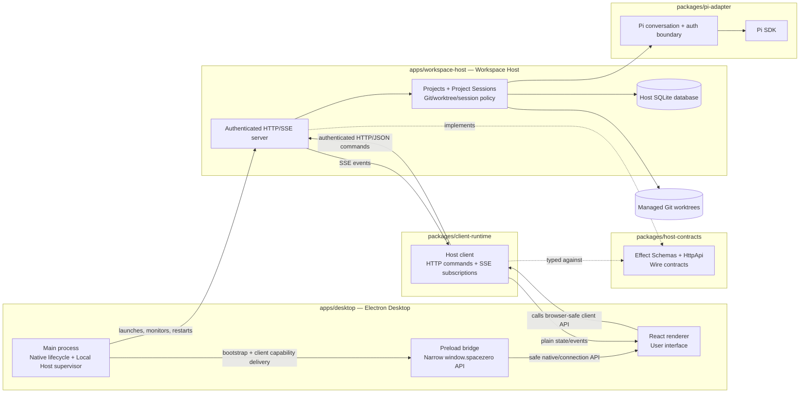

# Project Architecture

Space Zero v0.1 is split into a trusted Desktop application and a separately executable Workspace Host.

The important rule is: **Desktop is the native shell and client; Workspace Host owns Project and Session execution.**

## Runtime communication diagram

## Main communication paths

### 1. Desktop starts the Local Host

Electron main launches the Workspace Host as a separate process. Bootstrap material is passed through a protected inherited channel, not through command-line arguments, environment variables, URLs, logs, or renderer state.

Desktop main keeps supervisor authority. Renderer only receives short-lived scoped client capabilities through preload.

### 2. Renderer talks to Host through Client Runtime

React renderer does not receive raw Node.js, Electron, filesystem, SQLite, Git, Pi, or credential access.

For product operations, renderer calls `@spacezero/client-runtime`. Client Runtime sends authenticated HTTP/JSON commands and consumes authenticated SSE event streams from Workspace Host.

### 3. Host Protocol is shared as contracts, not implementation

`@spacezero/host-contracts` defines the stable wire shapes with Effect Schema and HttpApi declarations.

Both sides depend on the contracts:

- Client Runtime uses them to send and decode browser-safe protocol values.
- Workspace Host implements them in its HTTP/SSE handlers.

The contracts do not expose Electron types, React types, Pi SDK types, database rows, filesystem handles, or Host implementation internals.

### 4. Workspace Host owns Project and Session state

Workspace Host owns the Project catalog, Project Session domain behavior, event journal, relational projections, SQLite migrations, managed Git worktrees, and recovery policy.

Desktop can display and request this behavior, but does not duplicate or persist it.

### 5. Pi stays behind the Pi Adapter

Workspace Host delegates Pi-specific mechanics to `@spacezero/pi-adapter`.

The adapter owns Pi provider auth storage, conversation setup, SDK integration, event translation, and test seams. Pi credentials and transcripts must not leak into Host Protocol contracts, SQLite Session events, logs, URLs, worktrees, or renderer persistent state.

## Boundary summary

| Boundary | Rule |
| --- | --- |
| Desktop main ↔ Workspace Host | Main launches/supervises Host and holds supervisor authority. Host owns product runtime behavior. |
| Preload ↔ Renderer | Preload exposes only a narrow safe API. No raw Electron, Node, filesystem, or supervisor capability reaches renderer. |
| Renderer ↔ Client Runtime | Renderer consumes plain browser-safe client APIs and projections. React stays Effect-free where practical. |
| Client Runtime ↔ Workspace Host | Authenticated HTTP/JSON commands and authenticated SSE events. |
| Contracts ↔ Implementations | Contracts define serializable wire shapes only; implementation types stay behind their owning runtime. |
| Workspace Host ↔ Pi Adapter | Host owns Space Zero Sessions; Pi Adapter owns Pi-specific mechanics. |
