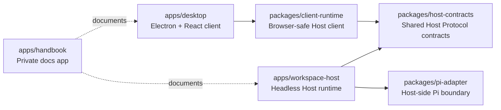
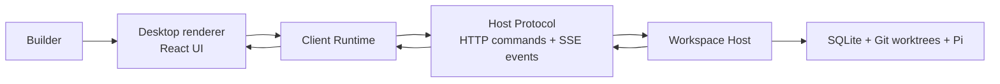
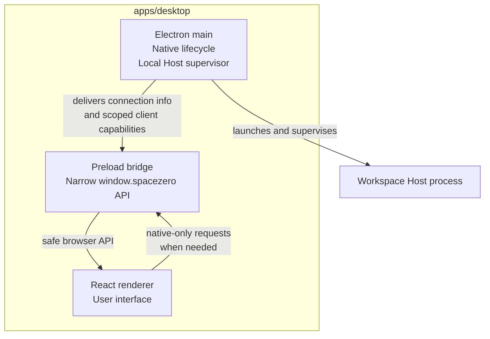
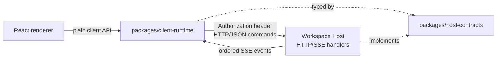
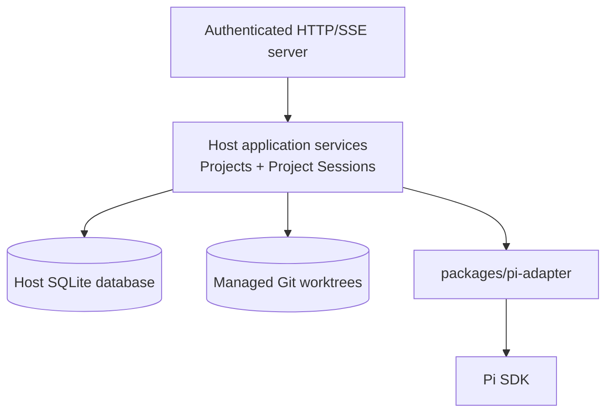
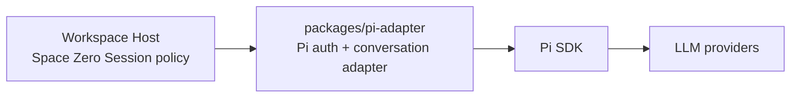

# Project Architecture

Space Zero v0.1 is split into a trusted Desktop application and a separately executable Workspace Host.

The important rule is: **Desktop is the native shell and client; Workspace Host owns Project and Session execution.**

This page starts with the broad monorepo communication map, then drills down into runtime behavior step by step.

## 1. App and package overview

At the package level, Desktop and Workspace Host do not import each other's application source. They meet through shared contracts and client/runtime packages.

- `apps/desktop` uses `packages/client-runtime` to talk to the Host.
- `packages/client-runtime` and `apps/workspace-host` both depend on `packages/host-contracts`.
- `apps/workspace-host` uses `packages/pi-adapter` for Pi-specific mechanics.
- `apps/handbook` documents the system, but does not participate in product runtime behavior.

## 2. Product communication flow

This is the normal product path. The user interacts with the React UI. The UI calls Client Runtime. Client Runtime sends authenticated HTTP/JSON commands to Workspace Host and listens for authenticated SSE events. Workspace Host performs the real Project, Session, Git, SQLite, and Pi work, then publishes events back to the client.

Electron main is not a proxy for ordinary Project or Session behavior.

## 3. Desktop runtime drill-down

Desktop has three internal surfaces:

### Electron main

Owns app lifecycle, windows, native integration, Local Host launch/supervision, protected bootstrap, and supervisor authority.

### Preload

Exposes only a narrow, typed browser-safe bridge to the renderer. It can deliver Host connection information and short-lived scoped client capabilities.

### Renderer

Owns UI only. It must not receive raw Node.js, Electron, filesystem, shell, SQLite, Git, Pi, or credential access.

## 4. Host Protocol drill-down

`packages/host-contracts` defines the stable wire shapes: schemas, endpoint declarations, event envelopes, command/query payloads, and public errors.

Client Runtime uses those contracts to call the Host. Workspace Host implements those contracts at the HTTP/SSE boundary. Contracts do not expose Electron types, React types, Pi SDK types, database rows, filesystem handles, or Host implementation internals.

## 5. Workspace Host drill-down

Workspace Host owns the Project catalog, Project Session behavior, event journal, relational projections, SQLite migrations, managed Git worktrees, and recovery policy.

Desktop can display and request this behavior, but does not duplicate or persist it.

## 6. Pi boundary drill-down

Workspace Host owns Space Zero Sessions. Pi Adapter owns Pi-specific mechanics: provider auth storage, conversation setup, SDK integration, event translation, cancellation, cleanup, and test seams.

Pi credentials and transcripts must not leak into Host Protocol contracts, SQLite Session events, logs, URLs, worktrees, or renderer persistent state.
